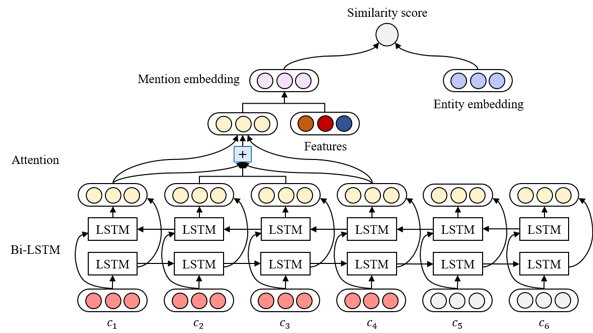

# fancy-nlp
[](https://travis-ci.org/boat-group/fancy-nlp)
[](https://coveralls.io/github/boat-group/fancy-nlp?branch=master)
[](http://commitizen.github.io/cz-cli/)

`fancy-nlp` 是一套易用的自然语言处理工具，其直接面向应用场景，满足用户对自然语言处理任务的需求，使得用户无需处理复杂的预处理等中间过程，直接针对自然语言文本来完成多种NLP任务，实现所想即所得！

## 安装

`fancy-nlp`当前支持在Python 3环节下使用：

```
cd fancy-nlp
python setup.py install
```
## 功能应用

在当前的动态商品广告业务中，我们为海量的商品建立了基础的商品画像信息，包括商品的品牌、类别、型号，已经品牌+类别、品牌+类别+型号所组成的商品SKU。使用`fancy-nlp`可以基于商品名的文本信息，分别使用一行代码，实现对商品品牌、型号等知识实体的提取，以及商品类别的分类：

```python
from fancy_nlp.application import ner, text_classification
# 品牌、型号等知识实体
entity_results_dict = ner.predict('Apple iPhone X (A1865) 64GB 深空灰色移动联通电信4G手机')
# 商品类别实体
category_dict = text_classification.predict('Apple iPhone X (A1865) 64GB 深空灰色移动联通电信4G手机')

``` 

- 商品知识实体识别：[Demo体验](http://10.50.85.97:8081/knowledge_info)
- 商品分类：[Demo体验](http://10.50.85.97:8081/text_classify)

在当前的业务场景中，知识实体的提取准确率F1值可以达到**0.8798**，商品分类准确率可以达到**0.8428**。

## 模型架构
### 知识实体识别
对于知识实体识别，我们使用字向量序列作为基础输入，并在此基础上：

- 加入分词特征，包括字所在词的词向量与位置向量；
- 加入邻接字特征，如bi-gram字向量，然后使用BiLSTM+CNN+CRF模型进行序列标注。


与基于词序列输入和基于字序列输入的模型相比，本实体识别方法可以显式利用句子中词的语义信息，同时还不会受分词错误的影响。

### 知识实体链接
对于实体链接模型，我们先使用基于注意力机制的Bi-LSTM模型抽取实体指称的语义特征，同时融合多种消歧特征：

- 文本相似度特征；
- 实体类型匹配特征；
- 基于文本中所有候选实体所构成的知识子图的多实体联合消歧特征，之后使用排序学习方法对候选实体列表进行排序，得到最佳匹配实体。



与传统方法相比，该链接模型融合多种消歧特征，能有效解决短文本上下文语境不丰富问题，提高泛化能力。

模型在多种特征组合场景的效果对比如下，数据集来自于[**CCKS 2019——中文短文本的实体链指**](https://biendata.com/competition/ccks_2019_el/)：

| batch | embed    | trainable | schema | encoder_type | crf |val_f1 |
|:-----:|:--------:|:---------:|:------:|:------------:|:---:|------:|
| 32    | c2v      | fix       | BIOES  | bilstm       |False|0.7399 |
| 32    | c2v      | fix       | BIOES  | bilstm       | True|0.7559 |
| 32    | c2v      | fix       | BIOES  | bigru        |False|0.7426 |
| 32    | c2v      | fix       | BIOES  | bigru        | True|0.7585 |
| 32    | c2v      | fix       | BIOES  | bilstm_cnn   |False|0.7593 |
| 32    | c2v      | fix       | BIOES  | bilstm_cnn   | True|0.7673 |
| 32    | c2v      | fix       | BIOES  | bigru_cnn    |False|0.7564 |
| 32    | c2v      | fix       | BIOES  | bigru_cnn    | True|0.7685 |


### 文本分类模型
对于文本分类模型，我们集成了当前常用的文本分类模型，并进行了对比试验，效果如下：

| 序号 |    模型名   | Precision |  Recal | Macro-F1 | Accuracy | Time(s)/60015个样本 |
|:----:|:-----------:|:---------:|:------:|:--------:|:--------:|:-------------------:|
|   1  |     CNN     |   0.7532  | 0.7453 |  0.7462  |  0.8636  |        4.7972       |
|   2  |     LSTM    |   0.7446  | 0.7339 |  0.7389  |  0.8599  |        4.8093       |
|   3  |   Bi-LSTM   |   0.7436  | 0.7374 |  0.7384  |  0.8594  |        8.7405       |
|   4  |    DPCNN    |   0.7411  | 0.7326 |  0.7333  |  0.8462  |        5.6679       |
|   5  |     RCNN    |   0.7687  | 0.7633 |  0.7639  |  0.8744  |       11.1846       |
|   6  |     DCNN    |   0.6873  | 0.6743 |  0.6746  |  0.7955  |        5.2111       |
|   7  |    VDCNN    |   0.7119  | 0.6981 |  0.7049  |  0.8065  |       53.2978       |
|   8  | Att_Bi-LSTM |   0.7512  | 0.7448 |  0.7549  |  0.8644  |        9.0593       |
|   9  | CNN-Bi-LSTM |   0.7486  | 0.7411 |  0.7422  |  0.8563  |        3.4688       |
|  10  |   FastText  |   0.7313  | 0.7270 |  0.7274  |  0.8400  |        1.1811       |

效果最优的是RCNN模型，这也是我们当前实际采用的模型。若从模型速度和性能兼顾的角度来考虑，可以采用CNN或FastText模型。

## Acknowledgement

- 本项目在**2019腾讯广告犀牛鸟专项研究计划**的支持下，由AMS-PTP-创意优化组allene、xinruchen、nickyhe与同济大学大数据处理与智能分析实验室联合开发
- `fancy-nlp`在**CCKS 2019——中文短文本的实体链指**评测竞赛中取得了初赛第三名，复赛[第五名](https://biendata.com/competition/ccks_2019_el/final-leaderboard/)的成绩，且获得了该评测竞赛唯一的一项[技术突破奖](https://biendata.com/competition/ccks_2019_el/winners/)

## Contribution

- 项目的代码规范符合PEP8标准，且每次提交会自动触发CI，并计算单测覆盖率
- 所有的代码提交请遵循[约定式提交规范](https://www.conventionalcommits.org/zh/v1.0.0-beta.4/)
- 所有的功能性代码请编写相应的单测模块


## fancy是什么寓意？

对于当前众多的NLP任务，例如序列标注、文本分类，大多数工具的设计都是偏向于模型的训练和评估。当普通用户希望将这些模型应用于实际业务场景中时，往往需要进行复杂的预处理和部署配置，这些过程往往和用户所期望的流程不符。因此`fancy`的寓意为**满足你的想象**，你可以在`fancy-nlp`中实现对NLP任务各个环节的一键式处理，高效将模型应用于实际的业务中。